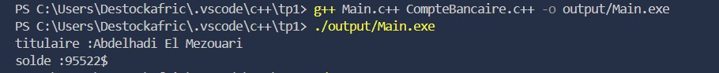

# TP C++ – Exercices Divers

## Exercice 1 : Gestion de Compte Bancaire Simple

### Description
Ce projet simule un compte bancaire simple en C++.  
La classe `CompteBancaire` permet de gérer le **titulaire** et le **solde** du compte, avec des méthodes pour déposer, retirer et afficher le solde.

### Fonctionnalités

1. **Gestion du compte**
   - Définir le titulaire du compte avec `definirTitulaire()`
   - Ajouter un montant avec `depot()`
   - Retirer un montant avec `retrait()`
   - Afficher le titulaire et le solde avec `afficher()`

### Capture du `main`

### Résultats du programme
Le programme affiche le titulaire et le solde du compte après chaque opération.  

---

## Exercice 2 : Gestion d’un Catalogue de Livres

### Description
Ce projet simule la gestion d’un catalogue de livres en C++.  
La classe `Livre` permet de stocker le **titre**, l’**auteur** et l’**année de publication** d’un ouvrage, et fournit des méthodes pour les gérer et les afficher.

### Fonctionnalités

1. **Création des livres**
   - Définir les informations d’un livre avec `definirLivre()`

2. **Affichage**
   - Afficher les informations d’un livre avec `afficher()`
   - Obtenir l’année de publication avec `getAnneePublication()`

### Capture du `main`

### Résultats du programme
Le programme affiche les informations complètes de chaque livre ajouté au catalogue.  

